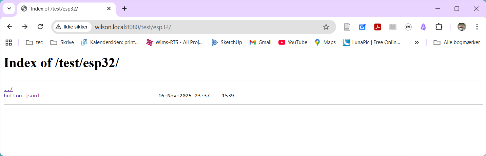
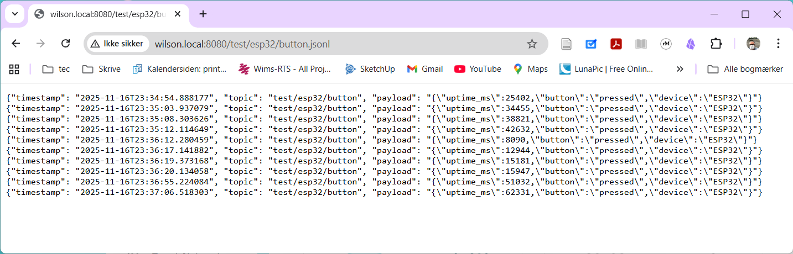

## Intro

MQTT er det nye sort inden for cloud data storage. Så det skal vi også have.\
Det giver bedst mening, alt i alt, at vi har en server lokalt.

MQTT serveren kaldes en broker, som implementerer en publish/subscribe arkitektur. Det betyder at de meddelelser publiseres til brokeren øjeblikligt sendes videre til abonnenterne (subscribers). Meddelelserne gemmes ikke på serveren, men skal modtages af en subscriber.

På den lokale server er der en subscriber, som gemmer alle meddelser i `jsonl`filer.

MQTT protokollen, gør at man kan sende meddelser til et *topic* en "payload".\
Topic er en form for adresse eller *path*. Et topic kunne f.eks. være `iot/del2/team-rocket/feedback`.\
Payload'en er en String med de data der gemmes. Payload er ofte formateret son json, især hvis payloaden består af flere dele.

For dem som hellere vil køre en server selv under udviklingsfacen, har jeg delt en docker-compose opsætning: <https://github.com/s0ren/mqtt_moquitto_docker_compose>.

## Fakta

### MQTT

|                               |                                  |
|-------------------------------|----------------------------------|
| Host                          | wilson.local eller 192.168.0.161 |
| Port (annonym)                | 1883                             |
| Port (TLS/SSL *ikke* annonym) | 8883                             |
| brugernavn                    | elev1                            |
| password                      | password                         |

### Web log

Weblog'gen er en webserver hvor kan se det mqtt-messages som serveren har modtaget.

Json filerne ligger i mapper, efter topic, og indeholder en linie med et json-streng objekt for hver message

{width="400"} {width="400"}

|      |                                                              |
|------|--------------------------------------------------------------|
| host | wilson.local eller 192.168.0.161                             |
| port | 8080                                                         |
| url  | <http://wilson.local:8080> eller <http://192.168.0.161:8080> |

CA cert: [./ca.crt](./ca.crt)

```         
-----BEGIN CERTIFICATE-----
MIIDBTCCAe2gAwIBAgIUXopiLMN2tHLH5ALoHzUf4tY5upUwDQYJKoZIhvcNAQEL
BQAwEjEQMA4GA1UEAwwHTVFUVC1DQTAeFw0yNTExMTYwOTQyMDlaFw0zNTExMTQw
OTQyMDlaMBIxEDAOBgNVBAMMB01RVFQtQ0EwggEiMA0GCSqGSIb3DQEBAQUAA4IB
DwAwggEKAoIBAQDTJehrHOy4YN3OmnVumeYq7gA7vd8iUoBLCsiHIGLAfnWA8b0f
r9XK3T552ztwfnZ6uK+T8kpqdQL0OczNXyEz2oi5e5MJAXYr1ytXns1SUQVgzj8F
Igl9i7MuwEYLyj9VjIjQgAhqDL2LlNomGyCfYoIhxJ0mvOii+yNsD5ghM2uLpaMu
FoP6k00gl0T/2fnJYKmy2frsRYxQLScf+arMHyXKcK89DVy5jQpFNhXHzqKwFgTY
kl0VIWp11ZKjCI3CNWl2t5U/GHbdHGf94TtXPvG5c6oe4hvd9On6d0fm12K5kc0C
ceQCq5pXP/z+a4acH8s2Iqfs+h0v8i4DtkFZAgMBAAGjUzBRMB0GA1UdDgQWBBTz
lQPbwuJ9LBR524FJXVYQArXcPjAfBgNVHSMEGDAWgBTzlQPbwuJ9LBR524FJXVYQ
ArXcPjAPBgNVHRMBAf8EBTADAQH/MA0GCSqGSIb3DQEBCwUAA4IBAQALGWCrskwS
BfaPnFZs8pm/FAcehS/YvdClyHoL4XBg7EqW+f72SiBy6Nu0Hgj7tPBwC0tPpKHA
IwVp5UN54IYGXnIgXirZOSxGBnoqS1ttrRYvrngmXg8woiQzaKryVEOGzwEI9/MI
qaclcDnK0G7KbYRnJ2o5mneyY87OKyBznW9ceas7o4hzGvKojY67nGrayWwjO7Iw
/4cXqqfWhE1x7znsU4IUXaL6CN/cpe6+forBUi84Cv6uVmeRhsABt+ENxaLG6CDu
Fd0rtKYmoqbkfqPGXeRVfvbJg0PJmrBHZG2KOMDC37fvIysHGc+jYl6yWh6b5mEG
uOn/9KgYpDzd
-----END CERTIFICATE-----
```

## Eksempeler

### CLI klient

Hvis du har installeret Mosquitto pubsub client, kan du køre denne:

```         
mosquitto_pub -h 192.168.0.161 -p 1883 -t "fisk/tun/yellowfin" -m "Hej verden"
```

### Python

I python kan man sende en mqtt message med dette korte script:

```python
import paho.mqtt.client as mqtt

# MQTT_HOST = "localhost"
MQTT_HOST = "wilson.local"

client = mqtt.Client()
client.connect(MQTT_HOST, 1883, 60)
client.publish("test/usikker", "Hello annon uden TLS, fra ekstern klient!")
```
Hele programfilen: [annon_client.py](https://github.com/s0ren/IOT_del2_demo_projecter/blob/main/mqtt_test_clients/annon_client.py).

### ESP32/Arduino

I [main.cpp](https://github.com/s0ren/IOT_del2_demo_projecter/blob/main/mqtt_test_clients/mqtt_button_esp32/src/main.cpp) ses en demo, som sender en mqtt-message når jeg trykker på knappen.

#### Enheden skal på wifi

``` cpp
#include <WiFi.h>
```
``` cpp
// WiFi indstillinger
const char* ssid = "IoT_H3/4";
const char* password = "98806829";
```
```cpp
void setup_wifi() {
  Serial.println();
  Serial.print("Connecting to WiFi");
  
  WiFi.begin(ssid, password);
  
  while (WiFi.status() != WL_CONNECTED) {
    delay(500);
    Serial.print(".");
  }
  
  Serial.println("\nWiFi connected!");
  Serial.print("IP: ");
  Serial.println(WiFi.localIP());
}
```
```cpp
void setup() {
  //...
  setup_wifi();
  //...
}
```

#### Åben MQTT

```cpp
#include <PubSubClient.h>
```
...
```cpp
// MQTT indstillinger
const char* mqtt_server = "wilson.local";  // f.eks. "192.168.1.100"
const int mqtt_port = 1883;
const char* mqtt_topic = "test/esp32/button";
```
...
```cpp
PubSubClient client(espClient);
```
...
`reconnect()` skal kaldes hver gang forbindelsen tabes.
```cpp
void reconnect() {
  while (!client.connected()) {
    Serial.print("Connecting to MQTT...");
    
    String clientId = "ESP32-" + String(random(0xffff), HEX);
    
    if (client.connect(clientId.c_str())) {
      Serial.println("connected");
    } else {
      Serial.print("failed, rc=");
      Serial.println(client.state());
      delay(5000);
    }
  }
}
```
I `setup()` aktiveres (mqtt) serveren:
```cpp
void setup() {
  //...
  client.setServer(mqtt_server, mqtt_port);
  //...
}
```
I `loop()` kaldes `reconnect()` hvis forbindelsen er væk. 
```cpp
void loop() {
  if (!client.connected()) {
    reconnect();
  }
```
og mqtt clienten checkes
```cpp
  client.loop();
```
og når vi er sikre på at knappen er trykket ned, sender vi en message.
```cpp
  //...
  if ((millis() - lastDebounceTime) > debounceDelay) {
    if (reading != buttonState) {
      //...
      if (buttonState == HIGH) {
        unsigned long uptime = millis();
        
        String payload = "{\"uptime_ms\":" + String(uptime) + 
                        ",\"button\":\"pressed\",\"device\":\"ESP32\"}";
        //...
        client.publish(mqtt_topic, payload.c_str());
      }
    }
  }
  //...
}
```


### med SSL/TSL

#### CLI

```         
mosquitto_pub -h localhost -p 8883   --cafile /mosquitto/certs/ca.crt   -u elev1 -P password   -t "test/sikker" -m "Med TLS og password"
```

#### ca cert fil

#### python

```python
import paho.mqtt.client as mqtt
import ssl
# from pathlib import Path

# CERT_PATH = Path()

# MQTT_HOST = "localhost"
MQTT_HOST = "wilson.local"

client = mqtt.Client()
client.username_pw_set("elev1", "password")

# Konfigurer TLS
client.tls_set(
    ca_certs="ca.crt",  # Path til CA certificate
    tls_version=ssl.PROTOCOL_TLSv1_2
)

# For self-signed certificates (kun til test!)
client.tls_insecure_set(True)

client.connect(MQTT_HOST, 8883, 60)
client.publish("test/sikker", "Hello via TLS, fra ekstern klient!")
```