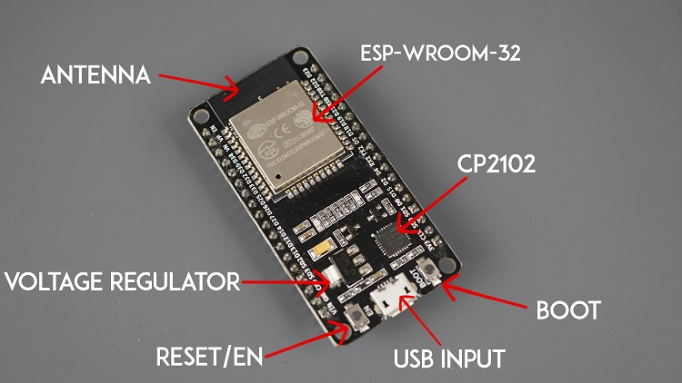

Her er anden del af faget ***17682 IoT og Embedded***. Første del blev gennemført på skoleforløbet H3.

Indholdet på anden del går dybere i strømbesparelse med *Deep Sleep*, mere internet opkobling, data lagring både lokalt og via internettet. Der er også mere om trådløs kommunikation, og udveksling mellem IoT enhederne.

En IoT enhed, er en processor med meget lidt periferiudstyr direkte, men med muligheder for udbygning, primært sensorer. Traditionelt har TEC brugt Arduino Uno og Arduino Mega, som skolen stadig råder over et antal af.\
Aktuelt, er undervisningen bygget op omkring Espresif's ESP32, nemlig **ESP32-DEVKIT-V1**.

{width="355"}

## Forløb

#### Uge 1

+------------------------+---------------------------+------------------------+----------------------------+---------------------------------------------+
| Mandag                 | Tirsdag                   | Onsdag                 | Torsdag                    | Fredag                                      |
+========================+===========================+========================+============================+=============================================+
| Re-introduktion af IoT | DeepSleep og inputevents  | Selvstendigt arbejde \ | Arbejde med projektopgaven | Gennemgang og presentation af projektopgave |
|                        |                           | med projektopgaven     |                            |                                             |
|                        | wifi "Station mode" \     |                        |                            |                                             |
|                        | og NTP                    |                        |                            |                                             |
|                        |                           |                        |                            |                                             |
|                        | MQTT introduktion         |                        |                            |                                             |
+------------------------+---------------------------+------------------------+----------------------------+---------------------------------------------+
|                        | Projekopgave Introduceres |                        |                            |                                             |
+------------------------+---------------------------+------------------------+----------------------------+---------------------------------------------+

#### Uge 2

+--------------------------------+--------------------------------------------------------------------+-----------------------------------------+----------------------------+------------------------------------------+
| Mandag                         | Tirsdag                                                            | Onsdag                                  | Torsdag                    | Fredag                                   |
+================================+====================================================================+=========================================+============================+==========================================+
| WiFi i AP mode                 | Geolokalisering med f.eks. *Triangulering*, matematisk og praktisk | Selvstendigt arbejde med projektopgaven | Arbejde med projektopgaven | Gennemgang/presentation af projektopgave |
|                                |                                                                    |                                         |                            |                                          |
| De pakker wifi klienter sender | Data fra enhed til enhed                                           |                                         |                            |                                          |
+--------------------------------+--------------------------------------------------------------------+-----------------------------------------+----------------------------+------------------------------------------+
|                                | Projekopgave Introduceres                                          |                                         |                            |                                          |
+--------------------------------+--------------------------------------------------------------------+-----------------------------------------+----------------------------+------------------------------------------+

## Indhold

-   Demoer, øvelser og opgaver
-   Projektopgaver
-   Væktøjer (IDE, diagrammer etc)
    -   PlatformIO
    -   Fritzing
        -   more parts
-   Referencer
    -   ESP32 DEVKIT V1 specifikationer
    -   Espresif programmin
    -   Aurduino framework
    -   Tutorials
        -   Random Nerd
        -   ...
-   Emner
    -   Re-introduktion af IoT
        -   Hardware
        -   Input/output
        -   flow, timing og events
    -   Deep Sleep
    -   Wifi
    -   Data lagring
        -   lokalt, på filsystem
        -   remote, med MQTT
        -   formater (json, csv, ...)
    -   Find andre enheder på nettet
    -   Kommunikation mellem IoT enheder
    -   Triangulering af enheder